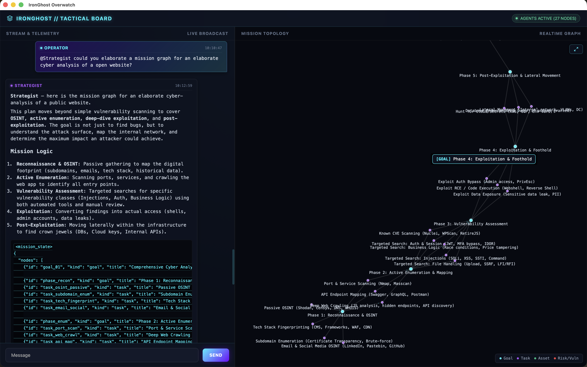

# IronGhost

[](https://opensource.org/licenses/MIT)
[](https://www.rust-lang.org/)
[](https://en.cppreference.com/w/cpp/20)
[](https://tauri.app/)
[](https://svelte.dev/)
[](https://apple.com)
[](#-philosophy-the-montesquieu-c3-protocol)

> **An Autonomous, Human-in-the-Loop Cyber Command & Control (C3) Architecture Powered by Multi-Agent Cognitive Orchestration.**



---

## 🏛️ Philosophy: The "Montesquieu-C3" Protocol

**IronGhost** is built around a core architectural principle: **The Separation of Powers**. 

Traditional AI agent frameworks often grant Large Language Models (LLMs) direct code execution capabilities—creating catastrophic security and reliability risks. IronGhost solves this by decoupling cognition, orchestration, and execution into strict, isolated boundaries:

1. **Dual-Channel Governance**:
   * **Cognitive Cooperative Channel (Blackboard)**: A shared forum where specialized LLM agents collaborate, propose strategies, and build a real-time **Mission Knowledge Graph**.
   * **Hierarchical Command & Control (C2)**: A strict military-grade command chain. Human Operators hold the highest authority and must validate actions before execution.
2. **Strict Isolation & Execution Safety**:
   * **No Direct AI Execution**: LLMs *cannot* execute code. They are cognitive advisors, not execution runtimes.
   * **Deterministic Workers**: Execution is offloaded to isolated, non-AI worker environments (e.g., dedicated Kali Linux VMs) running deterministic, audited scripts.
   * **Safe Orchestration**: A central **Rust Orchestrator** manages message routing, state transitions, human validations, and alert escalations without using any internal LLM logic.

---

## 🏗️ Architecture & Modules

The repository currently exposes the core infrastructure modules:

```code
                  +-----------------------------------+
                  |      Human Operator (Tauri UI)    |
                  +-----------------+-----------------+
                                    | (WebSocket)
                                    v
+-----------------------------------+-----------------------------------+
|                     IronGhost Overwatch (Rust)                        |
|   - Mission Graph & State Engine      - Human-in-the-Loop Validation  |
|   - Multi-Agent Message Router        - Guardrails & Command Sanitizer|
+-----------------+---------------------------------+-------------------+
                  |                                 |
        (Binary over UDS Socket)              (Future C2 Link)
                  |                                 |
                  v                                 v
+-----------------+-----------------+     +---------+-------------------+
|      ironghost-services (C++)     |     |   Deterministic Workers     |
|   - Custom Lean LLM Engine        |     |   - Kali Linux Target VM    |
|   - Zero-Copy Binary Protocol     |     |   - Isolated Script Exec    |
+-----------------------------------+     +-----------------------------+
```

### 📦 Published Modules

* **`ironghost-overwatch`** *(Rust / Tauri / Svelte)*:
  * The memory-safe, asynchronous orchestrator.
  * Manages agent lifecycle, event broadcasting, and mission topology state.
  * Renders a real-time 3D/2D tactical mission graph and operational chat interface.
* **`ironghost-services`** *(C++ / Native)*:
  * High-performance, lean LLM inference service designed for local execution (model agnostic).
  * Communicates via custom **Binary IPC over Unix Domain Sockets (UDS)** for ultra-low latency and zero-copy performance.

---

## ⚡ Performance Highlights

* **Zero-Copy IPC**: Bypasses heavy REST/gRPC overhead by utilizing native C++ binary framing over Unix Domain Sockets, offering near-zero inter-agent messaging latency.
* **Grammar-Constrained Output**: Forces LLM inference to adhere strictly to GBNF grammars, guaranteeing 100% valid JSON payload generation for mission graph updates.
* **Memory Safety**: Core orchestration written in Rust, eliminating memory corruption vulnerabilities at the control layer.

---

## 🚀 Quick Start

### Prerequisites

* Rust toolchain (`cargo`, `rustc`)
* C++20 compliant compiler (`clang++` or `g++`)
* macOS (Apple Silicon optimized) or Linux

### Building `ironghost-services` (C++)

First create a `models` directory in which you will put your models (`.gguf` format):

```bash
cd ironghost-services
mkdir models
```

Other sub-directories in `ironghost-services/` correspond to an independant inference service (you can create as many services as you need). Three examples are given in this repo: `agent-strategist`, `agent-coder` and `agent-generic`.

For each service:

- configure your `.env` file (in `ironghost-services/agent-<your_service>/.env`) (examples provided, to be adapted your own setup) ;
- in `src/prompts/` you may provide a system prompt (`.txt`) and a grammar (`.gbnf`).

Build your service:

```bash
cd ironghost-services/agent-<your_service>
mkdir build && cd build
rm -rf * 
cmake .. -DCMAKE_BUILD_TYPE=Release
make -j$(nproc)
```

Launch your service:

```bash
cd build/
./agent_<your_service>
```

### Running `ironghost-overwatch` (Rust)

```bash
cd ironghost-overwatch
cargo run --release
```

> Note that agents react to tagging `@<name_of_you_agent>` in board messages. Automatic tagging will be implemented in future version.

## 🗺️ Roadmap

- [x] Lean C++ Binary LLM IPC Service over Unix Domain Sockets
- [x] Asynchronous Rust Board Orchestrator & Event Pipeline
- [x] Real-time Svelte/Tauri Tactical Overwatch Dashboard
- [x] Dynamic Mission Knowledge Graph Generation (<mission_state>)
- [ ] Integration of Deterministic Kali Linux Execution Workers
- [ ] Formalized C2 Protocol for Sandboxed Worker Execution

## 📄 License

Distributed under the MIT License. See `LICENSE` for more information.