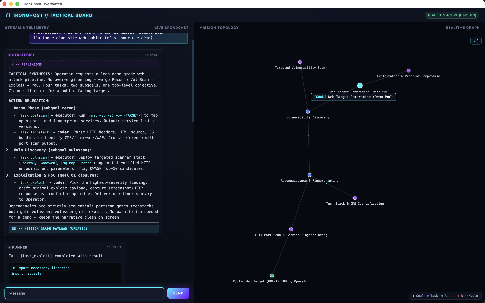

# IronGhost

[](https://opensource.org/licenses/MIT)
[](https://www.rust-lang.org/)
[](https://en.cppreference.com/w/cpp/17)
[](https://tauri.app/)
[](https://svelte.dev/)
[](https://apple.com)
[](#-philosophy-the-montesquieu-c3-protocol)

> **Mission-driven orchestration for untrusted AI agents.**

---

AI systems should propose.
Deterministic systems should execute.

IronGhost separates cognition, orchestration and execution through a mission-centric architecture where LLMs are treated as untrusted components.

```code
AI Agents
      │
      ▼
 Mission Graph
      │
      ▼
 Mission Compiler
      │
      ▼
 Execution DAG
      │
      ▼
 Sentinels
      │
      ▼
 Human Approval
      │
      ▼
 Deterministic Workers
```

## 🎬 Demo video

[](https://github.com/user-attachments/assets/82ffeccf-ba36-426b-b21d-a6ecfafab175)

## 🏛️ Philosophy: The "Montesquieu-C3" Protocol

**IronGhost** treats LLMs as *untrusted cognitive components*. They may propose plans, code and assessments, but they never execute actions directly. The Mission Graph is the sole source of truth.

### Mission Graph

The Mission Graph is the persistent state of the system.

Agents are transient.

Contexts are discarded.

Messages are ephemeral.

The Mission Graph is the only authoritative representation of the mission.

### Mission-Centric Architecture

Traditional AI frameworks are agent-centric:

```code
Agent
 ↓
Tool
 ↓
Action
```

IronGhost is mission-centric:

```code
Agents
 ↓
Mission Graph
 ↓
Execution DAG
 ↓
Workers
```

Agents do not hold the system state. The Mission Graph does.

### Zero-Trust AI

**IronGhost** is built around a core architectural principle: **The Separation of Powers**, inspired by a Zero-Trust approach.

IronGhost assumes that every LLM can:

- hallucinate
- drift
- be manipulated
- produce unsafe code
- misunderstand mission context

Therefore:

- agents are isolated
- specialized agents use an amnesia protocol
- sentinels independently validate outputs
- workers are deterministic
- execution authority remains outside the AI layer

### The Amnesia Protocol

IronGhost deliberately avoids long-lived cognitive state.

Specialized agents:

- receive a bounded task
- complete the task
- publish outputs to the Mission Graph
- discard their context

This prevents:

- cognitive drift
- hidden state accumulation
- context poisoning
- non-reproducible decisions

Persistent state belongs to the Mission Graph, not to the agents.

### Dual-Channel Governance

While traditional AI agent frameworks often grant Large Language Models (LLMs) direct code execution capabilities—creating security and reliability risks, providing agents with more memory and autonomy, IronGhost decouples cognition, orchestration, and execution into strict, isolated boundaries, and follows a "minimal" trust philosophy:

1. **Dual-Channel Governance**:
   * **Cognitive Cooperative Channel (Blackboard)**: A shared forum where cognitive AI agents collaborate, propose strategies, and propose a **Mission Graph**.
   * **Hierarchical Command & Control (C2)**: A strict command chain. Human Operators hold the highest authority and validate actions before execution. The Mission Graph, is rendered in real time, and is translated into an execution graph (deterministic) under strict automated (sentinels) and human supervision.
2. **Strict Isolation & Execution Safety**:
   * **No Direct AI Execution**: LLMs *cannot* execute code. They are either cognitive advisors, specialized agents or sentinels (with amnesia protocol) with no execution runtimes.
   * **Deterministic Workers**: Execution is offloaded to isolated, non-AI worker environments (e.g., dedicated Kali Linux VMs) running deterministic, curated scripts.
   * **Safe Orchestration**: A central **Rust Orchestrator** manages message routing, state transitions, human validations, and alert escalations without using any internal LLM logic.
   * **Sentinel Filtering**: Special agents, *Sentinels*, are tasked to filter all code before they reach workers. Sentinels are isolated from other AI agents, and have an *amnesia* protocol (stateless - clear KV-cache etc.).

Example of action process:

```code
+-------------------------------------------------------------------+
|                        Mission Graph State                        |
|                                                                   |
|   [Node 1: Recon] ----> [Node 2: Vuln Scan]                       |
|   (Status: SUCCESS)     (Status: PROPOSED)                        |
|                                 |                                 |
|                                 v (Human Approved)                |
|                         [Node 3: Exploitation]                    |
|                         (Status: PENDING_EXECUTION)               |
+---------------------------------+---------------------------------+
                                  |
                        (Rust Engine Dispatch)
                                  v
                  +---------------+---------------+
                  |  Sentinel Filter & Validation |
                  +---------------+---------------+
                                  |
                                  v
                  +---------------+---------------+
                  |  Deterministic Worker (Kali)  |
                  +-------------------------------+
```

---

## What IronGhost Is Not

IronGhost is not:

- an autonomous offensive AI
- a self-executing agent framework
- a direct Tool-Use runtime
- an AGI experimentation platform

IronGhost is a mission execution architecture where AI proposes and deterministic systems execute.

---

## 🏗️ Architecture & Modules

The repository currently exposes the core infrastructure modules:

```code
                  +-----------------------------------+
                  |      Human Operator (Tauri UI)    |
                  +-----------------+-----------------+
                                    | (WebSocket)
                                    v
+-----------------------------------+-----------------------------------+
|                     IronGhost Overwatch (Rust)                        |
|   - Mission Graph & State Engine      - Human-in-the-Loop Validation  |
|   - Multi-Agent Message Router        - Guardrails & Command Sanitizer|
+-----------------+---------------------------------+-------------------+
                  |                                 |
        (Binary over UDS Socket)        (C2 Link + Sentinel filtering)
                  |                                 |
                  v                                 v
+-----------------+-----------------+     +---------+-------------------+
|      ironghost-services (C++)     |     |   Deterministic Workers     |
|   - Custom Lean LLM Engine        |     |   - Kali Linux Target VM    |
|   - Zero-Copy Binary Protocol     |     |   - Isolated Script Exec    |
+-----------------------------------+     +-----------------------------+
```

> Note: the C2 Link, Sentinel filtering, and deterministic workers are not currently published.

### 📦 Published Modules

* **`ironghost-overwatch`** *(Rust / Tauri / Svelte)*:
  * The memory-safe, asynchronous orchestrator.
  * Manages agent lifecycle, event broadcasting, and mission topology state.
  * Renders a real-time 3D/2D tactical mission graph and operational chat interface.
* **`ironghost-services`** *(C++ / Native)*:
  * High-performance, lean LLM inference service designed for local execution (model agnostic).
  * Communicates via custom **Binary IPC over Unix Domain Sockets (UDS)** for ultra-low latency and zero-copy performance.
  > NB: Using different types of llm micro-services is possible but not shown here (e.g. protobuf, gRPC or REST frameworks).

---

## ⚡ Performance Highlights

* **Zero-Copy IPC**: Bypasses heavy REST/gRPC overhead by utilizing native C++ binary framing over Unix Domain Sockets, offering low inter-agent messaging latency. This is mainly designed for local implementations. Cloud implementations are possible but not shown here.
* **Grammar-Constrained Output**: Forces LLM inference to adhere strictly to GBNF grammars.
* **Memory Safety**: Core orchestration written in Rust, eliminating memory corruption vulnerabilities at the control layer.

---

## 🚀 Quick Start

### Prerequisites

* Rust toolchain (`cargo`, `rustc`)
* C++17 compliant compiler (`clang++` or `g++`)
* Node (used by `Tauri` in dev mode for the desktop app)
* macOS (Apple Silicon optimized) or Linux

### Building `ironghost-services` (C++)

Install `llama.cpp` in project root (or change config in your service `CMakeLists.txt`):

```bash
git clone https://github.com/ggml-org/llama.cpp
```

Create a `models` directory in which you will put your models (`.gguf` format):

```bash
cd ironghost-services
mkdir models
```

Import your models in this directory.

Other sub-directories in `ironghost-services/` correspond to independant inference services (you can create as many services as you need - providing your machine can hold them). Three examples are given in this repo: 2 cognitive agents (statefull): `agent-strategist`, and `agent-generic`; and a specialized agent: `spec-agent-coder` (stateless).

For each service:

- configure your `.env` file (in `ironghost-services/<your_service>/.env`) (examples provided, to be adapted according to your own setup) ;
- in `src/config/` you may provide a custom system prompt (`.txt`) and a grammar (`.gbnf`).

Build your service:

```bash
cd ironghost-services/<your_service>
mkdir build && cd build
rm -rf * 
cmake .. -DCMAKE_BUILD_TYPE=Release
make -j$(nproc 2>/dev/null || sysctl -n hw.ncpu)
```

Launch your services:

```bash
cd build/
./<your_service_binary>
```

> TODO: script this.

### Running `ironghost-overwatch` (Rust)

```bash
cd ironghost-overwatch
cargo run --release
```

> Note that, at this stage of development, agents react to tagging `!@<name_of_you_agent>` in board messages. Automatic tagging will be implemented in future version.

#### For dev mode:

##### 1. launch *overwatch* backend:

```bash
cd ironghost-overwatch/src-backend
cargo run -p backend --bin main 
```

##### 2. launch *overwatch* frontend (accesible at `http://localhost:5173/`):

```bash
cd ironghost-overwatch/src-front
npm run dev
```

##### 3. launch *overwatch* app (for desktop app view):

```bash
cd ironghost-overwatch
npm run tauri dev 
```

## 🗺️ Roadmap

- [x] Lean C++ Binary LLM IPC Service over Unix Domain Sockets
- [x] Asynchronous Rust Board Orchestrator & Event Pipeline
- [x] Real-time Svelte/Tauri Tactical Overwatch Dashboard
- [x] Dynamic Mission Knowledge Graph Generation (<mission_state>)
- [x] Implementation of Mission Graph runner with parallel execution (execution DiGraph)
- [ ] Integration of Deterministic Kali Linux Execution Workers
- [ ] Formalized C2 Protocol for Sandboxed Worker Execution
- [ ] Sentinel policy engine
- [ ] Mission Graph validator
- [ ] Worker cancellation propagation
- [ ] Mission versioning
- [ ] Mission graph signatures
- [ ] RBAC and operator workflow
- [ ] Formal Mission DSL
- [ ] Mission Graph persistence
- [ ] Mission replay & audit trail
- [ ] Deterministic policy engine

## 📄 License

Distributed under the MIT License. See `LICENSE` for more information.